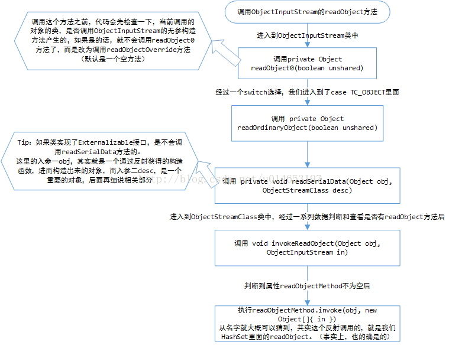

## HashMap 1.7

```java
package java.util;
import java.io.*;
/**
jdk1.7版本
*/
public class HashMap<K,V> extends AbstractMap<K,V> implements Map<K,V>, Cloneable, Serializable
{
/**   默认的容量 16  必须是一个2的次方 */
static final int DEFAULT_INITIAL_CAPACITY = 1 << 4; // aka 16

/** 最大的容量、隐式的指定了一个更高的值作为构造函数的参数  必须要小于2的30次方(1,073,741,824 约10亿7千万) */
static final int MAXIMUM_CAPACITY = 1 << 30;

/** 构造函数没有指定加载因子时默认值是0.75  */
static final float DEFAULT_LOAD_FACTOR = 0.75f;

/** 空表实例 当table is not inflated时*/
static final Entry<?,?>[] EMPTY_TABLE = {};

/**  此表作为重置使用，长度必须是2的次方 */
transient Entry<K,V>[] table = (Entry<K,V>[]) EMPTY_TABLE;

/** 实际存储数据大小*/
transient int size;

/** 阈值  = 当前容量*加载因子,如果size大于阈值并且table[hash]哈希计算后的桶为已填数据 就需要扩容，扩容的 大小是2倍的当前table长度。*/
int threshold;

/**加载因子*/
final float loadFactor;

/** HashMap结构发生改变的次数 ，结构变更是这个HashMap映射数和其他内部结构的修改。比如 rehash */
transient int modCount;

/** 替代哈希默认阈值*/
static final int ALTERNATIVE_HASHING_THRESHOLD_DEFAULT = Integer.MAX_VALUE;

private static class Holder {

    /**alternative(备选、替代) hashing. */
    static final int ALTERNATIVE_HASHING_THRESHOLD;

    static {
    	//从启动参数中加载阈值（即指定阈值）
        String altThreshold = java.security.AccessController.doPrivileged(new sun.security.action.GetPropertyAction("jdk.map.althashing.threshold"));

        int threshold;
        try {
            threshold = (null != altThreshold) ? Integer.parseInt(altThreshold): ALTERNATIVE_HASHING_THRESHOLD_DEFAULT;
            // disable alternative hashing if -1
            if (threshold == -1) { threshold = Integer.MAX_VALUE; }
            if (threshold < 0) { throw new IllegalArgumentException("value must be positive integer."); }
        } catch(IllegalArgumentException failed) {
            throw new Error("Illegal value for 'jdk.map.althashing.threshold'", failed);
        }

        ALTERNATIVE_HASHING_THRESHOLD = threshold;
    }
}

/** 计算哈希时使用，哈希种子 */
transient int hashSeed = 0;

/** 
 构造一个初始化为initialCapacity和loadFactor 的空HashMap 容量小于2^30大于0，加载因子非负数
 */
public HashMap(int initialCapacity, float loadFactor) {
    if (initialCapacity < 0) throw new IllegalArgumentException("Illegal initial capacity: " +initialCapacity);
    if (initialCapacity > MAXIMUM_CAPACITY)  initialCapacity = MAXIMUM_CAPACITY;
    if (loadFactor <= 0 || Float.isNaN(loadFactor)) throw new IllegalArgumentException("Illegal load factor: " +  loadFactor);
	//Float.isNaN(loadFactor) 有点假，多余
    this.loadFactor = loadFactor;
    threshold = initialCapacity;
    init();//待子类实现
}

/**默认加载因子0.75，指定初始化容量 */
public HashMap(int initialCapacity) {
    this(initialCapacity, DEFAULT_LOAD_FACTOR);
}

/**默认容量(16) 和默认加载因子(0.75).*/
public HashMap() {
    this(DEFAULT_INITIAL_CAPACITY, DEFAULT_LOAD_FACTOR);
}

/**默认加载因子0.75，初始化容量是插入的1.33倍+1（相当于扩容）的整数*/
public HashMap(Map<? extends K, ? extends V> m) {
    this(Math.max((int) (m.size() / DEFAULT_LOAD_FACTOR) + 1, DEFAULT_INITIAL_CAPACITY), DEFAULT_LOAD_FACTOR);
    inflateTable(threshold);//初始化table

    putAllForCreate(m);
}

/**number 1到2^30之间  
Integer.higestOneBit(i) 这个函数的作用是取 i 这个数的二进制形式最左边的最高一位且高位后面全部补零，最后返回int型的结果。
*/
private static int roundUpToPowerOf2(int number) {
    return number >= MAXIMUM_CAPACITY ? MAXIMUM_CAPACITY : (number > 1) ? Integer.highestOneBit((number - 1) << 1) : 1;
}

/** 初始化数组  */
private void inflateTable(int toSize) {
    // Find a power of 2 >= toSize 大于toSize的2的次方数，比如toSize=3,则capacity=4
    int capacity = roundUpToPowerOf2(toSize);

    threshold = (int) Math.min(capacity * loadFactor, MAXIMUM_CAPACITY + 1);
    table = new Entry[capacity];
    initHashSeedAsNeeded(capacity);//初始化hashSeed
}

void init() { }

/** 初始化hashSeed */
final boolean initHashSeedAsNeeded(int capacity) {
    boolean currentAltHashing = hashSeed != 0;//初始化都为false
    boolean useAltHashing = sun.misc.VM.isBooted() && (capacity >= Holder.ALTERNATIVE_HASHING_THRESHOLD);
    boolean switching = currentAltHashing ^ useAltHashing;
    if (switching) {
        hashSeed = useAltHashing ? sun.misc.Hashing.randomHashSeed(this) : 0;
    }
    return switching;
}

/**计算hash 如果k==null 则为0*/
final int hash(Object k) {
    int h = hashSeed;
    if (0 != h && k instanceof String) {
        return sun.misc.Hashing.stringHash32((String) k);
    }

    h ^= k.hashCode();//h=h^k.hashCode()  ^  相同为0,不同为1
 
    h ^= (h >>> 20) ^ (h >>> 12);
    return h ^ (h >>> 7) ^ (h >>> 4);
}

/**
 * 根据hash值与table的长度，计算出table表的下表。从计算来看结果都小于table的长度
 */
static int indexFor(int h, int length) {
    return h & (length-1);
}

/**已存储数据的数量 */
public int size() {  return size; }

/**判空*/
public boolean isEmpty() {  return size == 0; }

/**根据key获取对应的值*/
public V get(Object key) {
    if (key == null)
        return getForNullKey();//key==null,从table[0]的链表中取值
    Entry<K,V> entry = getEntry(key);

    return null == entry ? null : entry.getValue();
}

/** key为null的值*/
private V getForNullKey() {
    if (size == 0) {  return null; }
    for (Entry<K,V> e = table[0]; e != null; e = e.next) {
        if (e.key == null)
            return e.value;
    }
    return null;
}

/** 是否包含，从getEntry中取值判断*/
public boolean containsKey(Object key) {
    return getEntry(key) != null;
}

/** 根据key获取entry */
final Entry<K,V> getEntry(Object key) {
    if (size == 0) {  return null; }

    int hash = (key == null) ? 0 : hash(key);//计算hash值
    for (Entry<K,V> e = table[indexFor(hash, table.length)];//根据hash获取table的位置，获取链表
         e != null; e = e.next) {
        Object k;
        if (e.hash == hash && ((k = e.key) == key || (key != null && key.equals(k))))
            return e;
    }
    return null;
}

/**  存储k-v */
public V put(K key, V value) {
    if (table == EMPTY_TABLE) {
        inflateTable(threshold);
    }
    if (key == null)
        return putForNullKey(value);
    int hash = hash(key);
    int i = indexFor(hash, table.length);
    for (Entry<K,V> e = table[i]; e != null; e = e.next) {//判断是否hash冲突，冲突则替换，并返回旧值
        Object k;
        if (e.hash == hash && ((k = e.key) == key || key.equals(k))) {
            V oldValue = e.value;
            e.value = value;
            e.recordAccess(this);
            return oldValue;
        }
    }

    modCount++;
    addEntry(hash, key, value, i);//插入k-v
    return null;
}

private V putForNullKey(V value) {//put 空,null的key放置在table[0]的链表中
    for (Entry<K,V> e = table[0]; e != null; e = e.next) {
        if (e.key == null) {
            V oldValue = e.value;
            e.value = value;
            e.recordAccess(this);
            return oldValue;
        }
    }
    modCount++;
    addEntry(0, null, value, 0);
    return null;
}

/** put & create*/
private void putForCreate(K key, V value) {
    int hash = null == key ? 0 : hash(key);
    int i = indexFor(hash, table.length);

    for (Entry<K,V> e = table[i]; e != null; e = e.next) {
        Object k;
        if (e.hash == hash &&
            ((k = e.key) == key || (key != null && key.equals(k)))) {
            e.value = value;
            return;
        }
    }

    createEntry(hash, key, value, i);
}

private void putAllForCreate(Map<? extends K, ? extends V> m) {
    for (Map.Entry<? extends K, ? extends V> e : m.entrySet())
        putForCreate(e.getKey(), e.getValue());
}

//
void resize(int newCapacity) {
    Entry[] oldTable = table;
    int oldCapacity = oldTable.length;
    if (oldCapacity == MAXIMUM_CAPACITY) {
        threshold = Integer.MAX_VALUE;
        return;
    }

    Entry[] newTable = new Entry[newCapacity];
    transfer(newTable, initHashSeedAsNeeded(newCapacity));
    table = newTable;
    threshold = (int)Math.min(newCapacity * loadFactor, MAXIMUM_CAPACITY + 1);//计算新的阈值
}

/**  修改表结构 ，会新建一个表 ，重新整理Map中数据*/
void transfer(Entry[] newTable, boolean rehash) {
    int newCapacity = newTable.length;
    for (Entry<K,V> e : table) {
        while(null != e) {
            Entry<K,V> next = e.next;
            if (rehash) {
                e.hash = null == e.key ? 0 : hash(e.key);
            }
            int i = indexFor(e.hash, newCapacity);
            e.next = newTable[i];
            newTable[i] = e;
            e = next;
        }
    }
}

/**   */
public void putAll(Map<? extends K, ? extends V> m) {
    int numKeysToBeAdded = m.size();
    if (numKeysToBeAdded == 0)
        return;

    if (table == EMPTY_TABLE) {
        inflateTable((int) Math.max(numKeysToBeAdded * loadFactor, threshold));
    }

    
    if (numKeysToBeAdded > threshold) {
        int targetCapacity = (int)(numKeysToBeAdded / loadFactor + 1);
        if (targetCapacity > MAXIMUM_CAPACITY)
            targetCapacity = MAXIMUM_CAPACITY;
        int newCapacity = table.length;
        while (newCapacity < targetCapacity)
            newCapacity <<= 1;
        if (newCapacity > table.length)
            resize(newCapacity);
    }

    for (Map.Entry<? extends K, ? extends V> e : m.entrySet())
        put(e.getKey(), e.getValue());
}

public V remove(Object key) {
    Entry<K,V> e = removeEntryForKey(key);
    return (e == null ? null : e.value);
}

final Entry<K,V> removeEntryForKey(Object key) {
    if (size == 0) {
        return null;
    }
    int hash = (key == null) ? 0 : hash(key);
    int i = indexFor(hash, table.length);
    Entry<K,V> prev = table[i];
    Entry<K,V> e = prev;

    while (e != null) {
        Entry<K,V> next = e.next;
        Object k;
        if (e.hash == hash && ((k = e.key) == key || (key != null && key.equals(k)))) {//判断是否hash冲突
            modCount++;
            size--;
            if (prev == e)
                table[i] = next;
            else
                prev.next = next;
            e.recordRemoval(this);
            return e;
        }
        prev = e;
        e = next;
    }

    return e;
}

final Entry<K,V> removeMapping(Object o) {
    if (size == 0 || !(o instanceof Map.Entry))
        return null;

    Map.Entry<K,V> entry = (Map.Entry<K,V>) o;
    Object key = entry.getKey();
    int hash = (key == null) ? 0 : hash(key);
    int i = indexFor(hash, table.length);
    Entry<K,V> prev = table[i];
    Entry<K,V> e = prev;

    while (e != null) {
        Entry<K,V> next = e.next;
        if (e.hash == hash && e.equals(entry)) {
            modCount++;
            size--;
            if (prev == e)
                table[i] = next;
            else
                prev.next = next;
            e.recordRemoval(this);
            return e;
        }
        prev = e;
        e = next;
    }

    return e;
}

public void clear() {
    modCount++;
    Arrays.fill(table, null);//for循环置空table
    size = 0;
}

public boolean containsValue(Object value) {
    if (value == null)
        return containsNullValue();

    Entry[] tab = table;
    for (int i = 0; i < tab.length ; i++)
        for (Entry e = tab[i] ; e != null ; e = e.next)
            if (value.equals(e.value))
                return true;
    return false;
}

private boolean containsNullValue() {
    Entry[] tab = table;
    for (int i = 0; i < tab.length ; i++)
        for (Entry e = tab[i] ; e != null ; e = e.next)
            if (e.value == null)
                return true;
    return false;
}


public Object clone() {
    HashMap<K,V> result = null;
    try {
        result = (HashMap<K,V>)super.clone();
    } catch (CloneNotSupportedException e) {
        // assert false;
    }
    if (result.table != EMPTY_TABLE) {
        result.inflateTable(Math.min(
            (int) Math.min(
                size * Math.min(1 / loadFactor, 4.0f),
                // we have limits...
                HashMap.MAXIMUM_CAPACITY),
           table.length));
    }
    result.entrySet = null;
    result.modCount = 0;
    result.size = 0;
    result.init();
    result.putAllForCreate(this);

    return result;
}

static class Entry<K,V> implements Map.Entry<K,V> {
    final K key;
    V value;
    Entry<K,V> next;
    int hash;

    Entry(int h, K k, V v, Entry<K,V> n) {
        value = v;
        next = n;
        key = k;
        hash = h;
    }

    public final K getKey() {
        return key;
    }

    public final V getValue() {
        return value;
    }

    public final V setValue(V newValue) {
        V oldValue = value;
        value = newValue;
        return oldValue;
    }

    public final boolean equals(Object o) {
        if (!(o instanceof Map.Entry))
            return false;
        Map.Entry e = (Map.Entry)o;
        Object k1 = getKey();
        Object k2 = e.getKey();
        if (k1 == k2 || (k1 != null && k1.equals(k2))) {
            Object v1 = getValue();
            Object v2 = e.getValue();
            if (v1 == v2 || (v1 != null && v1.equals(v2)))
                return true;
        }
        return false;
    }

    public final int hashCode() {
        return Objects.hashCode(getKey()) ^ Objects.hashCode(getValue());
    }

    public final String toString() {
        return getKey() + "=" + getValue();
    }
    
    void recordAccess(HashMap<K,V> m) {
    }

    void recordRemoval(HashMap<K,V> m) {
    }
}

void addEntry(int hash, K key, V value, int bucketIndex) {
    if ((size >= threshold) && (null != table[bucketIndex])) {
        resize(2 * table.length);//扩容
        hash = (null != key) ? hash(key) : 0;
        bucketIndex = indexFor(hash, table.length);
    }

    createEntry(hash, key, value, bucketIndex);
}

void createEntry(int hash, K key, V value, int bucketIndex) {
    Entry<K,V> e = table[bucketIndex];
    table[bucketIndex] = new Entry<>(hash, key, value, e);
    size++;
}

private abstract class HashIterator<E> implements Iterator<E> {
    Entry<K,V> next;        // next entry to return
    int expectedModCount;   // For fast-fail
    int index;              // current slot
    Entry<K,V> current;     // current entry

    HashIterator() {
        expectedModCount = modCount;
        if (size > 0) { // advance to first entry
            Entry[] t = table;
            while (index < t.length && (next = t[index++]) == null)
                ;
        }
    }

    public final boolean hasNext() {
        return next != null;
    }

    final Entry<K,V> nextEntry() {
        if (modCount != expectedModCount)   throw new ConcurrentModificationException();
        Entry<K,V> e = next;
        if (e == null)  throw new NoSuchElementException();

        if ((next = e.next) == null) {
            Entry[] t = table;
            while (index < t.length && (next = t[index++]) == null)
                ;
        }
        current = e;
        return e;
    }

    public void remove() {
        if (current == null)
            throw new IllegalStateException();
        if (modCount != expectedModCount)
            throw new ConcurrentModificationException();
        Object k = current.key;
        current = null;
        HashMap.this.removeEntryForKey(k);
        expectedModCount = modCount;
    }
}

private final class ValueIterator extends HashIterator<V> {
    public V next() {
        return nextEntry().value;
    }
}

private final class KeyIterator extends HashIterator<K> {
    public K next() {
        return nextEntry().getKey();
    }
}

private final class EntryIterator extends HashIterator<Map.Entry<K,V>> {
    public Map.Entry<K,V> next() {
        return nextEntry();
    }
}

// Subclass overrides these to alter behavior of views' iterator() method
Iterator<K> newKeyIterator()   {
    return new KeyIterator();
}
Iterator<V> newValueIterator()   {
    return new ValueIterator();
}
Iterator<Map.Entry<K,V>> newEntryIterator()   {
    return new EntryIterator();
}

private transient Set<Map.Entry<K,V>> entrySet = null;

public Set<K> keySet() {
    Set<K> ks = keySet;
    return (ks != null ? ks : (keySet = new KeySet()));
}

private final class KeySet extends AbstractSet<K> {
    public Iterator<K> iterator() {
        return newKeyIterator();
    }
    public int size() {
        return size;
    }
    public boolean contains(Object o) {
        return containsKey(o);
    }
    public boolean remove(Object o) {
        return HashMap.this.removeEntryForKey(o) != null;
    }
    public void clear() {
        HashMap.this.clear();
    }
}

public Collection<V> values() {
    Collection<V> vs = values;
    return (vs != null ? vs : (values = new Values()));
}

private final class Values extends AbstractCollection<V> {
    public Iterator<V> iterator() {
        return newValueIterator();
    }
    public int size() {
        return size;
    }
    public boolean contains(Object o) {
        return containsValue(o);
    }
    public void clear() {
        HashMap.this.clear();
    }
}


public Set<Map.Entry<K,V>> entrySet() {
    return entrySet0();
}

private Set<Map.Entry<K,V>> entrySet0() {
    Set<Map.Entry<K,V>> es = entrySet;
    return es != null ? es : (entrySet = new EntrySet());
}

private final class EntrySet extends AbstractSet<Map.Entry<K,V>> {
    public Iterator<Map.Entry<K,V>> iterator() {
        return newEntryIterator();
    }
    public boolean contains(Object o) {
        if (!(o instanceof Map.Entry))
            return false;
        Map.Entry<K,V> e = (Map.Entry<K,V>) o;
        Entry<K,V> candidate = getEntry(e.getKey());
        return candidate != null && candidate.equals(e);
    }
    public boolean remove(Object o) {
        return removeMapping(o) != null;
    }
    public int size() {
        return size;
    }
    public void clear() {
        HashMap.this.clear();
    }
}

//序列化时调用writeObject
private void writeObject(java.io.ObjectOutputStream s)
    throws IOException
{
    // Write out the threshold, loadfactor, and any hidden stuff
    s.defaultWriteObject();

    // Write out number of buckets
    if (table==EMPTY_TABLE) {
        s.writeInt(roundUpToPowerOf2(threshold));
    } else {
       s.writeInt(table.length);
    }

    // Write out size (number of Mappings)
    s.writeInt(size);

    // Write out keys and values (alternating)
    if (size > 0) {
        for(Map.Entry<K,V> e : entrySet0()) {
            s.writeObject(e.getKey());
            s.writeObject(e.getValue());
        }
    }
}

private static final long serialVersionUID = 362498820763181265L;

/**
 * 反序列化时需要重写readObject
 */
private void readObject(java.io.ObjectInputStream s) throws IOException, ClassNotFoundException
{
    // Read in the threshold (ignored), loadfactor, and any hidden stuff
    s.defaultReadObject();
    if (loadFactor <= 0 || Float.isNaN(loadFactor)) {
        throw new InvalidObjectException("Illegal load factor: " + loadFactor);
    }

   	//分配一个空的table
    table = (Entry<K,V>[]) EMPTY_TABLE;

    // Read in number of buckets
    s.readInt(); // ignored.

    // Read number of mappings
    int mappings = s.readInt();
    if (mappings < 0) throw new InvalidObjectException("Illegal mappings count: " +  mappings);

    // capacity chosen by number of mappings and desired load (if >= 0.25)
    int capacity = (int) Math.min(  mappings * Math.min(1 / loadFactor, 4.0f), HashMap.MAXIMUM_CAPACITY);

    // allocate the bucket array;
    if (mappings > 0) { inflateTable(capacity);} 
    else { threshold = capacity;  }

    init();  // Give subclass a chance to do its thing.

    // Read the keys and values, and put the mappings in the HashMap
    for (int i = 0; i < mappings; i++) {
        K key = (K) s.readObject();
        V value = (V) s.readObject();
        putForCreate(key, value);
    }
}

// These methods are used when serializing HashSets
int   capacity()     { return table.length; }
float loadFactor()   { return loadFactor;   }
}
```


HashMap是一个数组加单向链表的数据结构，数组可以从table的成员变量看出，单向链表可以从Entry和其中的next看出

null 为key 放在了table[0] 链表中

notice：执行构造函数时，存储元素的数组并不会进行初始化，而是在第一次放入元素的时候，才会进行初始化操作。创建HashMap对象时，仅仅计算初始容量和新增阈值。




## HashMap 1.8

```java
/*
 * Copyright (c) 1997, 2017, Oracle and/or its affiliates. All rights reserved.
 * ORACLE PROPRIETARY/CONFIDENTIAL. Use is subject to license terms.
 *jdk1.8
 */

package java.util;

import java.io.IOException;
import java.io.InvalidObjectException;
import java.io.Serializable;
import java.lang.reflect.ParameterizedType;
import java.lang.reflect.Type;
import java.util.function.BiConsumer;
import java.util.function.BiFunction;
import java.util.function.Consumer;
import java.util.function.Function;
import sun.misc.SharedSecrets;

public class HashMap<K,V> extends AbstractMap<K,V>
    implements Map<K,V>, Cloneable, Serializable {

    private static final long serialVersionUID = 362498820763181265L;
	//默认初始化容量16
    static final int DEFAULT_INITIAL_CAPACITY = 1 << 4; // aka 16
	//最大的容量2^30
    static final int MAXIMUM_CAPACITY = 1 << 30;
	//默认加载因子
    static final float DEFAULT_LOAD_FACTOR = 0.75f;
	//链表转化为红黑二叉树的最少Entry
    static final int TREEIFY_THRESHOLD = 8;
	//红黑二叉树转化为链表最少Entry
    static final int UNTREEIFY_THRESHOLD = 6;
    
    static final int MIN_TREEIFY_CAPACITY = 64;

    static class Node<K,V> implements Map.Entry<K,V> {
        final int hash;
        final K key;
        V value;
        Node<K,V> next;

        Node(int hash, K key, V value, Node<K,V> next) {
            this.hash = hash;
            this.key = key;
            this.value = value;
            this.next = next;
        }

        public final K getKey()        { return key; }
        public final V getValue()      { return value; }
        public final String toString() { return key + "=" + value; }

        public final int hashCode() {
            return Objects.hashCode(key) ^ Objects.hashCode(value);
        }

        public final V setValue(V newValue) {
            V oldValue = value;
            value = newValue;
            return oldValue;
        }

        public final boolean equals(Object o) {
            if (o == this)
                return true;
            if (o instanceof Map.Entry) {
                Map.Entry<?,?> e = (Map.Entry<?,?>)o;
                if (Objects.equals(key, e.getKey()) &&
                    Objects.equals(value, e.getValue()))
                    return true;
            }
            return false;
        }
    }

    /* ---------------- Static utilities -------------- */

    static final int hash(Object key) {
        int h;
        return (key == null) ? 0 : (h = key.hashCode()) ^ (h >>> 16);
    }

    static Class<?> comparableClassFor(Object x) {
        if (x instanceof Comparable) {
            Class<?> c; Type[] ts, as; Type t; ParameterizedType p;
            if ((c = x.getClass()) == String.class) // bypass checks
                return c;
            if ((ts = c.getGenericInterfaces()) != null) {
                for (int i = 0; i < ts.length; ++i) {
                    if (((t = ts[i]) instanceof ParameterizedType) &&
                        ((p = (ParameterizedType)t).getRawType() ==
                         Comparable.class) &&
                        (as = p.getActualTypeArguments()) != null &&
                        as.length == 1 && as[0] == c) // type arg is c
                        return c;
                }
            }
        }
        return null;
    }
    
    @SuppressWarnings({"rawtypes","unchecked"}) // for cast to Comparable
    static int compareComparables(Class<?> kc, Object k, Object x) {
        return (x == null || x.getClass() != kc ? 0 :
                ((Comparable)k).compareTo(x));
    }

	/*有点判断是否为2的次方的意思，(n&n-1)==0*/
    static final int tableSizeFor(int cap) {//假设cap默认容量为16
        int n = cap - 1;//15，1111
        n |= n >>> 1;//1111
        n |= n >>> 2;//1111
        n |= n >>> 4;//1111
        n |= n >>> 8;//1111
        n |= n >>> 16;//1111
        return (n < 0) ? 1 : (n >= MAXIMUM_CAPACITY) ? MAXIMUM_CAPACITY : n + 1;
    }

    /* ---------------- Fields -------------- */

    transient Node<K,V>[] table;
	//entry set
    transient Set<Map.Entry<K,V>> entrySet;

    transient int size;

    transient int modCount;

    int threshold;

    final float loadFactor;

    /* ---------------- Public operations -------------- */

    public HashMap(int initialCapacity, float loadFactor) {
        if (initialCapacity < 0)  throw new IllegalArgumentException("Illegal initial capacity: " + initialCapacity);
        if (initialCapacity > MAXIMUM_CAPACITY) initialCapacity = MAXIMUM_CAPACITY;
        if (loadFactor <= 0 || Float.isNaN(loadFactor))  throw new IllegalArgumentException("Illegal load factor: " + loadFactor);
        this.loadFactor = loadFactor;
        this.threshold = tableSizeFor(initialCapacity);//计算阈值
    }
    
    public HashMap(int initialCapacity) {
        this(initialCapacity, DEFAULT_LOAD_FACTOR);
    }

    public HashMap() {
        this.loadFactor = DEFAULT_LOAD_FACTOR; // all other fields defaulted
    }

    
    public HashMap(Map<? extends K, ? extends V> m) {
        this.loadFactor = DEFAULT_LOAD_FACTOR;
        putMapEntries(m, false);
    }

    final void putMapEntries(Map<? extends K, ? extends V> m, boolean evict) {
        int s = m.size();
        if (s > 0) {
            if (table == null) { // pre-size
                float ft = ((float)s / loadFactor) + 1.0F;
                int t = ((ft < (float)MAXIMUM_CAPACITY) ? (int)ft : MAXIMUM_CAPACITY);
                if (t > threshold)//大于阈值，重新计算容量
                    threshold = tableSizeFor(t);
            }
            else if (s > threshold)  resize();//如果size大于阈值整理Map结构
            for (Map.Entry<? extends K, ? extends V> e : m.entrySet()) {
                K key = e.getKey();
                V value = e.getValue();
                putVal(hash(key), key, value, false, evict);//增加新k-v,evict=false
            }
        }
    }

    public int size() {
        return size;
    }

    public boolean isEmpty() {
        return size == 0;
    }
    
    public V get(Object key) {
        Node<K,V> e;
        return (e = getNode(hash(key), key)) == null ? null : e.value;
    }

    final Node<K,V> getNode(int hash, Object key) {
        Node<K,V>[] tab; Node<K,V> first, e; int n; K k;
        if ((tab = table) != null && (n = tab.length) > 0 &&
            (first = tab[(n - 1) & hash]) != null)//计算table的index，并返回的一个Node
         {
            if (first.hash == hash && ((k = first.key) == key || (key != null && key.equals(k))))//判断是否冲突，always check first node
                return first;
            if ((e = first.next) != null) {
                if (first instanceof TreeNode)
                    return ((TreeNode<K,V>)first).getTreeNode(hash, key);//获取红黑二叉树中目标的Node
                do {
                    if (e.hash == hash && ((k = e.key) == key || (key != null && key.equals(k))))//轮询中了，返回
                        return e;
                } while ((e = e.next) != null);
            }
        }
        return null;
    }

    public boolean containsKey(Object key) {
        return getNode(hash(key), key) != null;
    }

    public V put(K key, V value) {
        return putVal(hash(key), key, value, false, true);
    }

    final V putVal(int hash, K key, V value, boolean onlyIfAbsent,  boolean evict) {
        Node<K,V>[] tab; Node<K,V> p; int n, i;
        
        if ((tab = table) == null || (n = tab.length) == 0)//判断当前table是否为空
            n = (tab = resize()).length;// 空的就需要初始化
            
        //根据当前 key 的 hashcode 定位到具体的Node中并判断是否为空，
        if ((p = tab[i = (n - 1) & hash]) == null)  //1.7使用indexFor方法
            tab[i] = newNode(hash, key, value, null);//为空,表明没有 Hash 冲突就直接在当前位置创建一个新Node即可
        else {
            Node<K,V> e; K k;
            if (p.hash == hash && ((k = p.key) == key || (key != null && key.equals(k))))//冲突否
                e = p;
            else if (p instanceof TreeNode)
                e = ((TreeNode<K,V>)p).putTreeVal(this, tab, hash, key, value);// to tree,but not treeify
            else {
                for (int binCount = 0; ; ++binCount) {
                    if ((e = p.next) == null) {
                        p.next = newNode(hash, key, value, null);
                        if (binCount >= TREEIFY_THRESHOLD - 1) // 链表的长度是否大于8，是则转化为红黑二叉树
                            treeifyBin(tab, hash);
                        break;
                    }
                    if (e.hash == hash && ((k = e.key) == key || (key != null && key.equals(k))))
                        break;
                    p = e;
                }
            }
            if (e != null) { // existing mapping for key
                V oldValue = e.value;
                if (!onlyIfAbsent || oldValue == null)
                    e.value = value;
                afterNodeAccess(e);
                return oldValue;
            }
        }
        ++modCount;
        if (++size > threshold) resize();//调整
        afterNodeInsertion(evict);
        return null;
    }

    final Node<K,V>[] resize() {
        Node<K,V>[] oldTab = table;
        int oldCap = (oldTab == null) ? 0 : oldTab.length;
        int oldThr = threshold;
        int newCap, newThr = 0;
        if (oldCap > 0) {
            if (oldCap >= MAXIMUM_CAPACITY) {
                threshold = Integer.MAX_VALUE;
                return oldTab;
            }
            else if ((newCap = oldCap << 1) < MAXIMUM_CAPACITY &&
                     oldCap >= DEFAULT_INITIAL_CAPACITY)
                newThr = oldThr << 1; // double threshold
        }
        else if (oldThr > 0) // initial capacity was placed in threshold
            newCap = oldThr;
        else {               // zero initial threshold signifies using defaults
            newCap = DEFAULT_INITIAL_CAPACITY;
            newThr = (int)(DEFAULT_LOAD_FACTOR * DEFAULT_INITIAL_CAPACITY);
        }
        if (newThr == 0) {
            float ft = (float)newCap * loadFactor;
            newThr = (newCap < MAXIMUM_CAPACITY && ft < (float)MAXIMUM_CAPACITY ?
                      (int)ft : Integer.MAX_VALUE);
        }
        threshold = newThr;
        @SuppressWarnings({"rawtypes","unchecked"})
        Node<K,V>[] newTab = (Node<K,V>[])new Node[newCap];
        table = newTab;
        if (oldTab != null) {
            for (int j = 0; j < oldCap; ++j) {
                Node<K,V> e;
                if ((e = oldTab[j]) != null) {
                    oldTab[j] = null;
                    if (e.next == null)
                        newTab[e.hash & (newCap - 1)] = e;
                    else if (e instanceof TreeNode)
                        ((TreeNode<K,V>)e).split(this, newTab, j, oldCap);
                    else { // preserve order
                        Node<K,V> loHead = null, loTail = null;
                        Node<K,V> hiHead = null, hiTail = null;
                        Node<K,V> next;
                        do {
                            next = e.next;
                            if ((e.hash & oldCap) == 0) {
                                if (loTail == null)
                                    loHead = e;
                                else
                                    loTail.next = e;
                                loTail = e;
                            }
                            else {
                                if (hiTail == null)
                                    hiHead = e;
                                else
                                    hiTail.next = e;
                                hiTail = e;
                            }
                        } while ((e = next) != null);
                        if (loTail != null) {
                            loTail.next = null;
                            newTab[j] = loHead;
                        }
                        if (hiTail != null) {
                            hiTail.next = null;
                            newTab[j + oldCap] = hiHead;
                        }
                    }
                }
            }
        }
        return newTab;
    }

    /**
     * Replaces all linked nodes in bin at index for given hash unless
     * table is too small, in which case resizes instead.
     */
    final void treeifyBin(Node<K,V>[] tab, int hash) {
        int n, index; Node<K,V> e;
        if (tab == null || (n = tab.length) < MIN_TREEIFY_CAPACITY)
            resize();
        else if ((e = tab[index = (n - 1) & hash]) != null) {
            TreeNode<K,V> hd = null, tl = null;
            do {
                TreeNode<K,V> p = replacementTreeNode(e, null);
                if (tl == null)
                    hd = p;
                else {
                    p.prev = tl;
                    tl.next = p;
                }
                tl = p;
            } while ((e = e.next) != null);
            if ((tab[index] = hd) != null)
                hd.treeify(tab);
        }
    }

    /**
     * Copies all of the mappings from the specified map to this map.
     * These mappings will replace any mappings that this map had for
     * any of the keys currently in the specified map.
     *
     * @param m mappings to be stored in this map
     * @throws NullPointerException if the specified map is null
     */
    public void putAll(Map<? extends K, ? extends V> m) {
        putMapEntries(m, true);
    }

    /**
     * Removes the mapping for the specified key from this map if present.
     *
     * @param  key key whose mapping is to be removed from the map
     * @return the previous value associated with <tt>key</tt>, or
     *         <tt>null</tt> if there was no mapping for <tt>key</tt>.
     *         (A <tt>null</tt> return can also indicate that the map
     *         previously associated <tt>null</tt> with <tt>key</tt>.)
     */
    public V remove(Object key) {
        Node<K,V> e;
        return (e = removeNode(hash(key), key, null, false, true)) == null ?
            null : e.value;
    }

    /**
     * Implements Map.remove and related methods
     *
     * @param hash hash for key
     * @param key the key
     * @param value the value to match if matchValue, else ignored
     * @param matchValue if true only remove if value is equal
     * @param movable if false do not move other nodes while removing
     * @return the node, or null if none
     */
    final Node<K,V> removeNode(int hash, Object key, Object value,
                               boolean matchValue, boolean movable) {
        Node<K,V>[] tab; Node<K,V> p; int n, index;
        if ((tab = table) != null && (n = tab.length) > 0 &&
            (p = tab[index = (n - 1) & hash]) != null) {
            Node<K,V> node = null, e; K k; V v;
            if (p.hash == hash &&
                ((k = p.key) == key || (key != null && key.equals(k))))
                node = p;
            else if ((e = p.next) != null) {
                if (p instanceof TreeNode)
                    node = ((TreeNode<K,V>)p).getTreeNode(hash, key);
                else {
                    do {
                        if (e.hash == hash &&
                            ((k = e.key) == key ||
                             (key != null && key.equals(k)))) {
                            node = e;
                            break;
                        }
                        p = e;
                    } while ((e = e.next) != null);
                }
            }
            if (node != null && (!matchValue || (v = node.value) == value ||
                                 (value != null && value.equals(v)))) {
                if (node instanceof TreeNode)
                    ((TreeNode<K,V>)node).removeTreeNode(this, tab, movable);
                else if (node == p)
                    tab[index] = node.next;
                else
                    p.next = node.next;
                ++modCount;
                --size;
                afterNodeRemoval(node);
                return node;
            }
        }
        return null;
    }

    /**
     * Removes all of the mappings from this map.
     * The map will be empty after this call returns.
     */
    public void clear() {
        Node<K,V>[] tab;
        modCount++;
        if ((tab = table) != null && size > 0) {
            size = 0;
            for (int i = 0; i < tab.length; ++i)
                tab[i] = null;
        }
    }

    /**
     * Returns <tt>true</tt> if this map maps one or more keys to the
     * specified value.
     *
     * @param value value whose presence in this map is to be tested
     * @return <tt>true</tt> if this map maps one or more keys to the
     *         specified value
     */
    public boolean containsValue(Object value) {
        Node<K,V>[] tab; V v;
        if ((tab = table) != null && size > 0) {
            for (int i = 0; i < tab.length; ++i) {
                for (Node<K,V> e = tab[i]; e != null; e = e.next) {
                    if ((v = e.value) == value ||
                        (value != null && value.equals(v)))
                        return true;
                }
            }
        }
        return false;
    }

    /**
     * Returns a {@link Set} view of the keys contained in this map.
     * The set is backed by the map, so changes to the map are
     * reflected in the set, and vice-versa.  If the map is modified
     * while an iteration over the set is in progress (except through
     * the iterator's own <tt>remove</tt> operation), the results of
     * the iteration are undefined.  The set supports element removal,
     * which removes the corresponding mapping from the map, via the
     * <tt>Iterator.remove</tt>, <tt>Set.remove</tt>,
     * <tt>removeAll</tt>, <tt>retainAll</tt>, and <tt>clear</tt>
     * operations.  It does not support the <tt>add</tt> or <tt>addAll</tt>
     * operations.
     *
     * @return a set view of the keys contained in this map
     */
    public Set<K> keySet() {
        Set<K> ks = keySet;
        if (ks == null) {
            ks = new KeySet();
            keySet = ks;
        }
        return ks;
    }

    final class KeySet extends AbstractSet<K> {
        public final int size()                 { return size; }
        public final void clear()               { HashMap.this.clear(); }
        public final Iterator<K> iterator()     { return new KeyIterator(); }
        public final boolean contains(Object o) { return containsKey(o); }
        public final boolean remove(Object key) {
            return removeNode(hash(key), key, null, false, true) != null;
        }
        public final Spliterator<K> spliterator() {
            return new KeySpliterator<>(HashMap.this, 0, -1, 0, 0);
        }
        public final void forEach(Consumer<? super K> action) {
            Node<K,V>[] tab;
            if (action == null)
                throw new NullPointerException();
            if (size > 0 && (tab = table) != null) {
                int mc = modCount;
                for (int i = 0; i < tab.length; ++i) {
                    for (Node<K,V> e = tab[i]; e != null; e = e.next)
                        action.accept(e.key);
                }
                if (modCount != mc)
                    throw new ConcurrentModificationException();
            }
        }
    }

    /**
     * Returns a {@link Collection} view of the values contained in this map.
     * The collection is backed by the map, so changes to the map are
     * reflected in the collection, and vice-versa.  If the map is
     * modified while an iteration over the collection is in progress
     * (except through the iterator's own <tt>remove</tt> operation),
     * the results of the iteration are undefined.  The collection
     * supports element removal, which removes the corresponding
     * mapping from the map, via the <tt>Iterator.remove</tt>,
     * <tt>Collection.remove</tt>, <tt>removeAll</tt>,
     * <tt>retainAll</tt> and <tt>clear</tt> operations.  It does not
     * support the <tt>add</tt> or <tt>addAll</tt> operations.
     *
     * @return a view of the values contained in this map
     */
    public Collection<V> values() {
        Collection<V> vs = values;
        if (vs == null) {
            vs = new Values();
            values = vs;
        }
        return vs;
    }

    final class Values extends AbstractCollection<V> {
        public final int size()                 { return size; }
        public final void clear()               { HashMap.this.clear(); }
        public final Iterator<V> iterator()     { return new ValueIterator(); }
        public final boolean contains(Object o) { return containsValue(o); }
        public final Spliterator<V> spliterator() {
            return new ValueSpliterator<>(HashMap.this, 0, -1, 0, 0);
        }
        public final void forEach(Consumer<? super V> action) {
            Node<K,V>[] tab;
            if (action == null)
                throw new NullPointerException();
            if (size > 0 && (tab = table) != null) {
                int mc = modCount;
                for (int i = 0; i < tab.length; ++i) {
                    for (Node<K,V> e = tab[i]; e != null; e = e.next)
                        action.accept(e.value);
                }
                if (modCount != mc)
                    throw new ConcurrentModificationException();
            }
        }
    }

    /**
     * Returns a {@link Set} view of the mappings contained in this map.
     * The set is backed by the map, so changes to the map are
     * reflected in the set, and vice-versa.  If the map is modified
     * while an iteration over the set is in progress (except through
     * the iterator's own <tt>remove</tt> operation, or through the
     * <tt>setValue</tt> operation on a map entry returned by the
     * iterator) the results of the iteration are undefined.  The set
     * supports element removal, which removes the corresponding
     * mapping from the map, via the <tt>Iterator.remove</tt>,
     * <tt>Set.remove</tt>, <tt>removeAll</tt>, <tt>retainAll</tt> and
     * <tt>clear</tt> operations.  It does not support the
     * <tt>add</tt> or <tt>addAll</tt> operations.
     *
     * @return a set view of the mappings contained in this map
     */
    public Set<Map.Entry<K,V>> entrySet() {
        Set<Map.Entry<K,V>> es;
        return (es = entrySet) == null ? (entrySet = new EntrySet()) : es;
    }

    final class EntrySet extends AbstractSet<Map.Entry<K,V>> {
        public final int size()                 { return size; }
        public final void clear()               { HashMap.this.clear(); }
        public final Iterator<Map.Entry<K,V>> iterator() {
            return new EntryIterator();
        }
        public final boolean contains(Object o) {
            if (!(o instanceof Map.Entry))
                return false;
            Map.Entry<?,?> e = (Map.Entry<?,?>) o;
            Object key = e.getKey();
            Node<K,V> candidate = getNode(hash(key), key);
            return candidate != null && candidate.equals(e);
        }
        public final boolean remove(Object o) {
            if (o instanceof Map.Entry) {
                Map.Entry<?,?> e = (Map.Entry<?,?>) o;
                Object key = e.getKey();
                Object value = e.getValue();
                return removeNode(hash(key), key, value, true, true) != null;
            }
            return false;
        }
        public final Spliterator<Map.Entry<K,V>> spliterator() {
            return new EntrySpliterator<>(HashMap.this, 0, -1, 0, 0);
        }
        public final void forEach(Consumer<? super Map.Entry<K,V>> action) {
            Node<K,V>[] tab;
            if (action == null)
                throw new NullPointerException();
            if (size > 0 && (tab = table) != null) {
                int mc = modCount;
                for (int i = 0; i < tab.length; ++i) {
                    for (Node<K,V> e = tab[i]; e != null; e = e.next)
                        action.accept(e);
                }
                if (modCount != mc)
                    throw new ConcurrentModificationException();
            }
        }
    }

    // Overrides of JDK8 Map extension methods

    @Override
    public V getOrDefault(Object key, V defaultValue) {
        Node<K,V> e;
        return (e = getNode(hash(key), key)) == null ? defaultValue : e.value;
    }

    @Override
    public V putIfAbsent(K key, V value) {
        return putVal(hash(key), key, value, true, true);
    }

    @Override
    public boolean remove(Object key, Object value) {
        return removeNode(hash(key), key, value, true, true) != null;
    }

    @Override
    public boolean replace(K key, V oldValue, V newValue) {
        Node<K,V> e; V v;
        if ((e = getNode(hash(key), key)) != null &&
            ((v = e.value) == oldValue || (v != null && v.equals(oldValue)))) {
            e.value = newValue;
            afterNodeAccess(e);
            return true;
        }
        return false;
    }

    @Override
    public V replace(K key, V value) {
        Node<K,V> e;
        if ((e = getNode(hash(key), key)) != null) {
            V oldValue = e.value;
            e.value = value;
            afterNodeAccess(e);
            return oldValue;
        }
        return null;
    }

    @Override
    public V computeIfAbsent(K key,
                             Function<? super K, ? extends V> mappingFunction) {
        if (mappingFunction == null)
            throw new NullPointerException();
        int hash = hash(key);
        Node<K,V>[] tab; Node<K,V> first; int n, i;
        int binCount = 0;
        TreeNode<K,V> t = null;
        Node<K,V> old = null;
        if (size > threshold || (tab = table) == null ||
            (n = tab.length) == 0)
            n = (tab = resize()).length;
        if ((first = tab[i = (n - 1) & hash]) != null) {
            if (first instanceof TreeNode)
                old = (t = (TreeNode<K,V>)first).getTreeNode(hash, key);
            else {
                Node<K,V> e = first; K k;
                do {
                    if (e.hash == hash &&
                        ((k = e.key) == key || (key != null && key.equals(k)))) {
                        old = e;
                        break;
                    }
                    ++binCount;
                } while ((e = e.next) != null);
            }
            V oldValue;
            if (old != null && (oldValue = old.value) != null) {
                afterNodeAccess(old);
                return oldValue;
            }
        }
        V v = mappingFunction.apply(key);
        if (v == null) {
            return null;
        } else if (old != null) {
            old.value = v;
            afterNodeAccess(old);
            return v;
        }
        else if (t != null)
            t.putTreeVal(this, tab, hash, key, v);
        else {
            tab[i] = newNode(hash, key, v, first);
            if (binCount >= TREEIFY_THRESHOLD - 1)
                treeifyBin(tab, hash);
        }
        ++modCount;
        ++size;
        afterNodeInsertion(true);
        return v;
    }

    public V computeIfPresent(K key,
                              BiFunction<? super K, ? super V, ? extends V> remappingFunction) {
        if (remappingFunction == null)
            throw new NullPointerException();
        Node<K,V> e; V oldValue;
        int hash = hash(key);
        if ((e = getNode(hash, key)) != null &&
            (oldValue = e.value) != null) {
            V v = remappingFunction.apply(key, oldValue);
            if (v != null) {
                e.value = v;
                afterNodeAccess(e);
                return v;
            }
            else
                removeNode(hash, key, null, false, true);
        }
        return null;
    }

    @Override
    public V compute(K key,
                     BiFunction<? super K, ? super V, ? extends V> remappingFunction) {
        if (remappingFunction == null)
            throw new NullPointerException();
        int hash = hash(key);
        Node<K,V>[] tab; Node<K,V> first; int n, i;
        int binCount = 0;
        TreeNode<K,V> t = null;
        Node<K,V> old = null;
        if (size > threshold || (tab = table) == null ||
            (n = tab.length) == 0)
            n = (tab = resize()).length;
        if ((first = tab[i = (n - 1) & hash]) != null) {
            if (first instanceof TreeNode)
                old = (t = (TreeNode<K,V>)first).getTreeNode(hash, key);
            else {
                Node<K,V> e = first; K k;
                do {
                    if (e.hash == hash &&
                        ((k = e.key) == key || (key != null && key.equals(k)))) {
                        old = e;
                        break;
                    }
                    ++binCount;
                } while ((e = e.next) != null);
            }
        }
        V oldValue = (old == null) ? null : old.value;
        V v = remappingFunction.apply(key, oldValue);
        if (old != null) {
            if (v != null) {
                old.value = v;
                afterNodeAccess(old);
            }
            else
                removeNode(hash, key, null, false, true);
        }
        else if (v != null) {
            if (t != null)
                t.putTreeVal(this, tab, hash, key, v);
            else {
                tab[i] = newNode(hash, key, v, first);
                if (binCount >= TREEIFY_THRESHOLD - 1)
                    treeifyBin(tab, hash);
            }
            ++modCount;
            ++size;
            afterNodeInsertion(true);
        }
        return v;
    }

    @Override
    public V merge(K key, V value,
                   BiFunction<? super V, ? super V, ? extends V> remappingFunction) {
        if (value == null)
            throw new NullPointerException();
        if (remappingFunction == null)
            throw new NullPointerException();
        int hash = hash(key);
        Node<K,V>[] tab; Node<K,V> first; int n, i;
        int binCount = 0;
        TreeNode<K,V> t = null;
        Node<K,V> old = null;
        if (size > threshold || (tab = table) == null ||
            (n = tab.length) == 0)
            n = (tab = resize()).length;
        if ((first = tab[i = (n - 1) & hash]) != null) {
            if (first instanceof TreeNode)
                old = (t = (TreeNode<K,V>)first).getTreeNode(hash, key);
            else {
                Node<K,V> e = first; K k;
                do {
                    if (e.hash == hash &&
                        ((k = e.key) == key || (key != null && key.equals(k)))) {
                        old = e;
                        break;
                    }
                    ++binCount;
                } while ((e = e.next) != null);
            }
        }
        if (old != null) {
            V v;
            if (old.value != null)
                v = remappingFunction.apply(old.value, value);
            else
                v = value;
            if (v != null) {
                old.value = v;
                afterNodeAccess(old);
            }
            else
                removeNode(hash, key, null, false, true);
            return v;
        }
        if (value != null) {
            if (t != null)
                t.putTreeVal(this, tab, hash, key, value);
            else {
                tab[i] = newNode(hash, key, value, first);
                if (binCount >= TREEIFY_THRESHOLD - 1)
                    treeifyBin(tab, hash);
            }
            ++modCount;
            ++size;
            afterNodeInsertion(true);
        }
        return value;
    }

    @Override
    public void forEach(BiConsumer<? super K, ? super V> action) {
        Node<K,V>[] tab;
        if (action == null)
            throw new NullPointerException();
        if (size > 0 && (tab = table) != null) {
            int mc = modCount;
            for (int i = 0; i < tab.length; ++i) {
                for (Node<K,V> e = tab[i]; e != null; e = e.next)
                    action.accept(e.key, e.value);
            }
            if (modCount != mc)
                throw new ConcurrentModificationException();
        }
    }

    @Override
    public void replaceAll(BiFunction<? super K, ? super V, ? extends V> function) {
        Node<K,V>[] tab;
        if (function == null)
            throw new NullPointerException();
        if (size > 0 && (tab = table) != null) {
            int mc = modCount;
            for (int i = 0; i < tab.length; ++i) {
                for (Node<K,V> e = tab[i]; e != null; e = e.next) {
                    e.value = function.apply(e.key, e.value);
                }
            }
            if (modCount != mc)
                throw new ConcurrentModificationException();
        }
    }

    /* ------------------------------------------------------------ */
    // Cloning and serialization

    /**
     * Returns a shallow copy of this <tt>HashMap</tt> instance: the keys and
     * values themselves are not cloned.
     *
     * @return a shallow copy of this map
     */
    @SuppressWarnings("unchecked")
    @Override
    public Object clone() {
        HashMap<K,V> result;
        try {
            result = (HashMap<K,V>)super.clone();
        } catch (CloneNotSupportedException e) {
            // this shouldn't happen, since we are Cloneable
            throw new InternalError(e);
        }
        result.reinitialize();
        result.putMapEntries(this, false);
        return result;
    }

    // These methods are also used when serializing HashSets
    final float loadFactor() { return loadFactor; }
    final int capacity() {
        return (table != null) ? table.length :
            (threshold > 0) ? threshold :
            DEFAULT_INITIAL_CAPACITY;
    }

    /**
     * Save the state of the <tt>HashMap</tt> instance to a stream (i.e.,
     * serialize it).
     *
     * @serialData The <i>capacity</i> of the HashMap (the length of the
     *             bucket array) is emitted (int), followed by the
     *             <i>size</i> (an int, the number of key-value
     *             mappings), followed by the key (Object) and value (Object)
     *             for each key-value mapping.  The key-value mappings are
     *             emitted in no particular order.
     */
    private void writeObject(java.io.ObjectOutputStream s)
        throws IOException {
        int buckets = capacity();
        // Write out the threshold, loadfactor, and any hidden stuff
        s.defaultWriteObject();
        s.writeInt(buckets);
        s.writeInt(size);
        internalWriteEntries(s);
    }

    /**
     * Reconstitute the {@code HashMap} instance from a stream (i.e.,
     * deserialize it).
     */
    private void readObject(java.io.ObjectInputStream s)
        throws IOException, ClassNotFoundException {
        // Read in the threshold (ignored), loadfactor, and any hidden stuff
        s.defaultReadObject();
        reinitialize();
        if (loadFactor <= 0 || Float.isNaN(loadFactor))
            throw new InvalidObjectException("Illegal load factor: " +
                                             loadFactor);
        s.readInt();                // Read and ignore number of buckets
        int mappings = s.readInt(); // Read number of mappings (size)
        if (mappings < 0)
            throw new InvalidObjectException("Illegal mappings count: " +
                                             mappings);
        else if (mappings > 0) { // (if zero, use defaults)
            // Size the table using given load factor only if within
            // range of 0.25...4.0
            float lf = Math.min(Math.max(0.25f, loadFactor), 4.0f);
            float fc = (float)mappings / lf + 1.0f;
            int cap = ((fc < DEFAULT_INITIAL_CAPACITY) ?
                       DEFAULT_INITIAL_CAPACITY :
                       (fc >= MAXIMUM_CAPACITY) ?
                       MAXIMUM_CAPACITY :
                       tableSizeFor((int)fc));
            float ft = (float)cap * lf;
            threshold = ((cap < MAXIMUM_CAPACITY && ft < MAXIMUM_CAPACITY) ?
                         (int)ft : Integer.MAX_VALUE);

            // Check Map.Entry[].class since it's the nearest public type to
            // what we're actually creating.
            SharedSecrets.getJavaOISAccess().checkArray(s, Map.Entry[].class, cap);
            @SuppressWarnings({"rawtypes","unchecked"})
            Node<K,V>[] tab = (Node<K,V>[])new Node[cap];
            table = tab;

            // Read the keys and values, and put the mappings in the HashMap
            for (int i = 0; i < mappings; i++) {
                @SuppressWarnings("unchecked")
                    K key = (K) s.readObject();
                @SuppressWarnings("unchecked")
                    V value = (V) s.readObject();
                putVal(hash(key), key, value, false, false);
            }
        }
    }

    /* ------------------------------------------------------------ */
    // iterators

    abstract class HashIterator {
        Node<K,V> next;        // next entry to return
        Node<K,V> current;     // current entry
        int expectedModCount;  // for fast-fail
        int index;             // current slot

        HashIterator() {
            expectedModCount = modCount;
            Node<K,V>[] t = table;
            current = next = null;
            index = 0;
            if (t != null && size > 0) { // advance to first entry
                do {} while (index < t.length && (next = t[index++]) == null);
            }
        }

        public final boolean hasNext() {
            return next != null;
        }

        final Node<K,V> nextNode() {
            Node<K,V>[] t;
            Node<K,V> e = next;
            if (modCount != expectedModCount)
                throw new ConcurrentModificationException();
            if (e == null)
                throw new NoSuchElementException();
            if ((next = (current = e).next) == null && (t = table) != null) {
                do {} while (index < t.length && (next = t[index++]) == null);
            }
            return e;
        }

        public final void remove() {
            Node<K,V> p = current;
            if (p == null)
                throw new IllegalStateException();
            if (modCount != expectedModCount)
                throw new ConcurrentModificationException();
            current = null;
            K key = p.key;
            removeNode(hash(key), key, null, false, false);
            expectedModCount = modCount;
        }
    }

    final class KeyIterator extends HashIterator
        implements Iterator<K> {
        public final K next() { return nextNode().key; }
    }

    final class ValueIterator extends HashIterator
        implements Iterator<V> {
        public final V next() { return nextNode().value; }
    }

    final class EntryIterator extends HashIterator
        implements Iterator<Map.Entry<K,V>> {
        public final Map.Entry<K,V> next() { return nextNode(); }
    }

    /* ------------------------------------------------------------ */
    // spliterators

    static class HashMapSpliterator<K,V> {
        final HashMap<K,V> map;
        Node<K,V> current;          // current node
        int index;                  // current index, modified on advance/split
        int fence;                  // one past last index
        int est;                    // size estimate
        int expectedModCount;       // for comodification checks

        HashMapSpliterator(HashMap<K,V> m, int origin,
                           int fence, int est,
                           int expectedModCount) {
            this.map = m;
            this.index = origin;
            this.fence = fence;
            this.est = est;
            this.expectedModCount = expectedModCount;
        }

        final int getFence() { // initialize fence and size on first use
            int hi;
            if ((hi = fence) < 0) {
                HashMap<K,V> m = map;
                est = m.size;
                expectedModCount = m.modCount;
                Node<K,V>[] tab = m.table;
                hi = fence = (tab == null) ? 0 : tab.length;
            }
            return hi;
        }

        public final long estimateSize() {
            getFence(); // force init
            return (long) est;
        }
    }

    static final class KeySpliterator<K,V>
        extends HashMapSpliterator<K,V>
        implements Spliterator<K> {
        KeySpliterator(HashMap<K,V> m, int origin, int fence, int est,
                       int expectedModCount) {
            super(m, origin, fence, est, expectedModCount);
        }

        public KeySpliterator<K,V> trySplit() {
            int hi = getFence(), lo = index, mid = (lo + hi) >>> 1;
            return (lo >= mid || current != null) ? null :
                new KeySpliterator<>(map, lo, index = mid, est >>>= 1,
                                        expectedModCount);
        }

        public void forEachRemaining(Consumer<? super K> action) {
            int i, hi, mc;
            if (action == null)
                throw new NullPointerException();
            HashMap<K,V> m = map;
            Node<K,V>[] tab = m.table;
            if ((hi = fence) < 0) {
                mc = expectedModCount = m.modCount;
                hi = fence = (tab == null) ? 0 : tab.length;
            }
            else
                mc = expectedModCount;
            if (tab != null && tab.length >= hi &&
                (i = index) >= 0 && (i < (index = hi) || current != null)) {
                Node<K,V> p = current;
                current = null;
                do {
                    if (p == null)
                        p = tab[i++];
                    else {
                        action.accept(p.key);
                        p = p.next;
                    }
                } while (p != null || i < hi);
                if (m.modCount != mc)
                    throw new ConcurrentModificationException();
            }
        }

        public boolean tryAdvance(Consumer<? super K> action) {
            int hi;
            if (action == null)
                throw new NullPointerException();
            Node<K,V>[] tab = map.table;
            if (tab != null && tab.length >= (hi = getFence()) && index >= 0) {
                while (current != null || index < hi) {
                    if (current == null)
                        current = tab[index++];
                    else {
                        K k = current.key;
                        current = current.next;
                        action.accept(k);
                        if (map.modCount != expectedModCount)
                            throw new ConcurrentModificationException();
                        return true;
                    }
                }
            }
            return false;
        }

        public int characteristics() {
            return (fence < 0 || est == map.size ? Spliterator.SIZED : 0) |
                Spliterator.DISTINCT;
        }
    }

    static final class ValueSpliterator<K,V>
        extends HashMapSpliterator<K,V>
        implements Spliterator<V> {
        ValueSpliterator(HashMap<K,V> m, int origin, int fence, int est,
                         int expectedModCount) {
            super(m, origin, fence, est, expectedModCount);
        }

        public ValueSpliterator<K,V> trySplit() {
            int hi = getFence(), lo = index, mid = (lo + hi) >>> 1;
            return (lo >= mid || current != null) ? null :
                new ValueSpliterator<>(map, lo, index = mid, est >>>= 1,
                                          expectedModCount);
        }

        public void forEachRemaining(Consumer<? super V> action) {
            int i, hi, mc;
            if (action == null)
                throw new NullPointerException();
            HashMap<K,V> m = map;
            Node<K,V>[] tab = m.table;
            if ((hi = fence) < 0) {
                mc = expectedModCount = m.modCount;
                hi = fence = (tab == null) ? 0 : tab.length;
            }
            else
                mc = expectedModCount;
            if (tab != null && tab.length >= hi &&
                (i = index) >= 0 && (i < (index = hi) || current != null)) {
                Node<K,V> p = current;
                current = null;
                do {
                    if (p == null)
                        p = tab[i++];
                    else {
                        action.accept(p.value);
                        p = p.next;
                    }
                } while (p != null || i < hi);
                if (m.modCount != mc)
                    throw new ConcurrentModificationException();
            }
        }

        public boolean tryAdvance(Consumer<? super V> action) {
            int hi;
            if (action == null)
                throw new NullPointerException();
            Node<K,V>[] tab = map.table;
            if (tab != null && tab.length >= (hi = getFence()) && index >= 0) {
                while (current != null || index < hi) {
                    if (current == null)
                        current = tab[index++];
                    else {
                        V v = current.value;
                        current = current.next;
                        action.accept(v);
                        if (map.modCount != expectedModCount)
                            throw new ConcurrentModificationException();
                        return true;
                    }
                }
            }
            return false;
        }

        public int characteristics() {
            return (fence < 0 || est == map.size ? Spliterator.SIZED : 0);
        }
    }

    static final class EntrySpliterator<K,V>
        extends HashMapSpliterator<K,V>
        implements Spliterator<Map.Entry<K,V>> {
        EntrySpliterator(HashMap<K,V> m, int origin, int fence, int est,
                         int expectedModCount) {
            super(m, origin, fence, est, expectedModCount);
        }

        public EntrySpliterator<K,V> trySplit() {
            int hi = getFence(), lo = index, mid = (lo + hi) >>> 1;
            return (lo >= mid || current != null) ? null :
                new EntrySpliterator<>(map, lo, index = mid, est >>>= 1,
                                          expectedModCount);
        }

        public void forEachRemaining(Consumer<? super Map.Entry<K,V>> action) {
            int i, hi, mc;
            if (action == null)
                throw new NullPointerException();
            HashMap<K,V> m = map;
            Node<K,V>[] tab = m.table;
            if ((hi = fence) < 0) {
                mc = expectedModCount = m.modCount;
                hi = fence = (tab == null) ? 0 : tab.length;
            }
            else
                mc = expectedModCount;
            if (tab != null && tab.length >= hi &&
                (i = index) >= 0 && (i < (index = hi) || current != null)) {
                Node<K,V> p = current;
                current = null;
                do {
                    if (p == null)
                        p = tab[i++];
                    else {
                        action.accept(p);
                        p = p.next;
                    }
                } while (p != null || i < hi);
                if (m.modCount != mc)
                    throw new ConcurrentModificationException();
            }
        }

        public boolean tryAdvance(Consumer<? super Map.Entry<K,V>> action) {
            int hi;
            if (action == null)
                throw new NullPointerException();
            Node<K,V>[] tab = map.table;
            if (tab != null && tab.length >= (hi = getFence()) && index >= 0) {
                while (current != null || index < hi) {
                    if (current == null)
                        current = tab[index++];
                    else {
                        Node<K,V> e = current;
                        current = current.next;
                        action.accept(e);
                        if (map.modCount != expectedModCount)
                            throw new ConcurrentModificationException();
                        return true;
                    }
                }
            }
            return false;
        }

        public int characteristics() {
            return (fence < 0 || est == map.size ? Spliterator.SIZED : 0) |
                Spliterator.DISTINCT;
        }
    }

    /* ------------------------------------------------------------ */
    // LinkedHashMap support


    /*
     * The following package-protected methods are designed to be
     * overridden by LinkedHashMap, but not by any other subclass.
     * Nearly all other internal methods are also package-protected
     * but are declared final, so can be used by LinkedHashMap, view
     * classes, and HashSet.
     */

    // Create a regular (non-tree) node
    Node<K,V> newNode(int hash, K key, V value, Node<K,V> next) {
        return new Node<>(hash, key, value, next);
    }

    // For conversion from TreeNodes to plain nodes
    Node<K,V> replacementNode(Node<K,V> p, Node<K,V> next) {
        return new Node<>(p.hash, p.key, p.value, next);
    }

    // Create a tree bin node
    TreeNode<K,V> newTreeNode(int hash, K key, V value, Node<K,V> next) {
        return new TreeNode<>(hash, key, value, next);
    }

    // For treeifyBin
    TreeNode<K,V> replacementTreeNode(Node<K,V> p, Node<K,V> next) {
        return new TreeNode<>(p.hash, p.key, p.value, next);
    }

    /**
     * Reset to initial default state.  Called by clone and readObject.
     */
    void reinitialize() {
        table = null;
        entrySet = null;
        keySet = null;
        values = null;
        modCount = 0;
        threshold = 0;
        size = 0;
    }

    // Callbacks to allow LinkedHashMap post-actions
    void afterNodeAccess(Node<K,V> p) { }
    void afterNodeInsertion(boolean evict) { }
    void afterNodeRemoval(Node<K,V> p) { }

    // Called only from writeObject, to ensure compatible ordering.
    void internalWriteEntries(java.io.ObjectOutputStream s) throws IOException {
        Node<K,V>[] tab;
        if (size > 0 && (tab = table) != null) {
            for (int i = 0; i < tab.length; ++i) {
                for (Node<K,V> e = tab[i]; e != null; e = e.next) {
                    s.writeObject(e.key);
                    s.writeObject(e.value);
                }
            }
        }
    }

    /* ------------------------------------------------------------ */
    // Tree bins

    /**
     * Entry for Tree bins. Extends LinkedHashMap.Entry (which in turn
     * extends Node) so can be used as extension of either regular or
     * linked node.
     */
    static final class TreeNode<K,V> extends LinkedHashMap.Entry<K,V> {
        TreeNode<K,V> parent;  // red-black tree links
        TreeNode<K,V> left;
        TreeNode<K,V> right;
        TreeNode<K,V> prev;    // needed to unlink next upon deletion
        boolean red;
        TreeNode(int hash, K key, V val, Node<K,V> next) {
            super(hash, key, val, next);
        }

        /**
         * Returns root of tree containing this node.
         */
        final TreeNode<K,V> root() {
            for (TreeNode<K,V> r = this, p;;) {
                if ((p = r.parent) == null)
                    return r;
                r = p;
            }
        }

        /**
         * Ensures that the given root is the first node of its bin.
         */
        static <K,V> void moveRootToFront(Node<K,V>[] tab, TreeNode<K,V> root) {
            int n;
            if (root != null && tab != null && (n = tab.length) > 0) {
                int index = (n - 1) & root.hash;
                TreeNode<K,V> first = (TreeNode<K,V>)tab[index];
                if (root != first) {
                    Node<K,V> rn;
                    tab[index] = root;
                    TreeNode<K,V> rp = root.prev;
                    if ((rn = root.next) != null)
                        ((TreeNode<K,V>)rn).prev = rp;
                    if (rp != null)
                        rp.next = rn;
                    if (first != null)
                        first.prev = root;
                    root.next = first;
                    root.prev = null;
                }
                assert checkInvariants(root);
            }
        }

        /**
         * Finds the node starting at root p with the given hash and key.
         * The kc argument caches comparableClassFor(key) upon first use
         * comparing keys.
         */
        final TreeNode<K,V> find(int h, Object k, Class<?> kc) {
            TreeNode<K,V> p = this;
            do {
                int ph, dir; K pk;
                TreeNode<K,V> pl = p.left, pr = p.right, q;
                if ((ph = p.hash) > h)
                    p = pl;
                else if (ph < h)
                    p = pr;
                else if ((pk = p.key) == k || (k != null && k.equals(pk)))
                    return p;
                else if (pl == null)
                    p = pr;
                else if (pr == null)
                    p = pl;
                else if ((kc != null ||
                          (kc = comparableClassFor(k)) != null) &&
                         (dir = compareComparables(kc, k, pk)) != 0)
                    p = (dir < 0) ? pl : pr;
                else if ((q = pr.find(h, k, kc)) != null)
                    return q;
                else
                    p = pl;
            } while (p != null);
            return null;
        }

        /**
         * Calls find for root node.
         */
        final TreeNode<K,V> getTreeNode(int h, Object k) {
            return ((parent != null) ? root() : this).find(h, k, null);
        }

        /**
         * Tie-breaking utility for ordering insertions when equal
         * hashCodes and non-comparable. We don't require a total
         * order, just a consistent insertion rule to maintain
         * equivalence across rebalancings. Tie-breaking further than
         * necessary simplifies testing a bit.
         */
        static int tieBreakOrder(Object a, Object b) {
            int d;
            if (a == null || b == null ||
                (d = a.getClass().getName().
                 compareTo(b.getClass().getName())) == 0)
                d = (System.identityHashCode(a) <= System.identityHashCode(b) ?
                     -1 : 1);
            return d;
        }

        /**
         * Forms tree of the nodes linked from this node.
         * @return root of tree
         */
        final void treeify(Node<K,V>[] tab) {
            TreeNode<K,V> root = null;
            for (TreeNode<K,V> x = this, next; x != null; x = next) {
                next = (TreeNode<K,V>)x.next;
                x.left = x.right = null;
                if (root == null) {
                    x.parent = null;
                    x.red = false;
                    root = x;
                }
                else {
                    K k = x.key;
                    int h = x.hash;
                    Class<?> kc = null;
                    for (TreeNode<K,V> p = root;;) {
                        int dir, ph;
                        K pk = p.key;
                        if ((ph = p.hash) > h)
                            dir = -1;
                        else if (ph < h)
                            dir = 1;
                        else if ((kc == null &&
                                  (kc = comparableClassFor(k)) == null) ||
                                 (dir = compareComparables(kc, k, pk)) == 0)
                            dir = tieBreakOrder(k, pk);

                        TreeNode<K,V> xp = p;
                        if ((p = (dir <= 0) ? p.left : p.right) == null) {
                            x.parent = xp;
                            if (dir <= 0)
                                xp.left = x;
                            else
                                xp.right = x;
                            root = balanceInsertion(root, x);
                            break;
                        }
                    }
                }
            }
            moveRootToFront(tab, root);
        }

        /**
         * Returns a list of non-TreeNodes replacing those linked from
         * this node.
         */
        final Node<K,V> untreeify(HashMap<K,V> map) {
            Node<K,V> hd = null, tl = null;
            for (Node<K,V> q = this; q != null; q = q.next) {
                Node<K,V> p = map.replacementNode(q, null);
                if (tl == null)
                    hd = p;
                else
                    tl.next = p;
                tl = p;
            }
            return hd;
        }

        /**
         * Tree version of putVal.
         */
        final TreeNode<K,V> putTreeVal(HashMap<K,V> map, Node<K,V>[] tab,
                                       int h, K k, V v) {
            Class<?> kc = null;
            boolean searched = false;
            TreeNode<K,V> root = (parent != null) ? root() : this;
            for (TreeNode<K,V> p = root;;) {
                int dir, ph; K pk;
                if ((ph = p.hash) > h)
                    dir = -1;
                else if (ph < h)
                    dir = 1;
                else if ((pk = p.key) == k || (k != null && k.equals(pk)))
                    return p;
                else if ((kc == null &&
                          (kc = comparableClassFor(k)) == null) ||
                         (dir = compareComparables(kc, k, pk)) == 0) {
                    if (!searched) {
                        TreeNode<K,V> q, ch;
                        searched = true;
                        if (((ch = p.left) != null &&
                             (q = ch.find(h, k, kc)) != null) ||
                            ((ch = p.right) != null &&
                             (q = ch.find(h, k, kc)) != null))
                            return q;
                    }
                    dir = tieBreakOrder(k, pk);
                }

                TreeNode<K,V> xp = p;
                if ((p = (dir <= 0) ? p.left : p.right) == null) {
                    Node<K,V> xpn = xp.next;
                    TreeNode<K,V> x = map.newTreeNode(h, k, v, xpn);
                    if (dir <= 0)
                        xp.left = x;
                    else
                        xp.right = x;
                    xp.next = x;
                    x.parent = x.prev = xp;
                    if (xpn != null)
                        ((TreeNode<K,V>)xpn).prev = x;
                    moveRootToFront(tab, balanceInsertion(root, x));
                    return null;
                }
            }
        }

        /**
         * Removes the given node, that must be present before this call.
         * This is messier than typical red-black deletion code because we
         * cannot swap the contents of an interior node with a leaf
         * successor that is pinned by "next" pointers that are accessible
         * independently during traversal. So instead we swap the tree
         * linkages. If the current tree appears to have too few nodes,
         * the bin is converted back to a plain bin. (The test triggers
         * somewhere between 2 and 6 nodes, depending on tree structure).
         */
        final void removeTreeNode(HashMap<K,V> map, Node<K,V>[] tab,
                                  boolean movable) {
            int n;
            if (tab == null || (n = tab.length) == 0)
                return;
            int index = (n - 1) & hash;
            TreeNode<K,V> first = (TreeNode<K,V>)tab[index], root = first, rl;
            TreeNode<K,V> succ = (TreeNode<K,V>)next, pred = prev;
            if (pred == null)
                tab[index] = first = succ;
            else
                pred.next = succ;
            if (succ != null)
                succ.prev = pred;
            if (first == null)
                return;
            if (root.parent != null)
                root = root.root();
            if (root == null || root.right == null ||
                (rl = root.left) == null || rl.left == null) {
                tab[index] = first.untreeify(map);  // too small
                return;
            }
            TreeNode<K,V> p = this, pl = left, pr = right, replacement;
            if (pl != null && pr != null) {
                TreeNode<K,V> s = pr, sl;
                while ((sl = s.left) != null) // find successor
                    s = sl;
                boolean c = s.red; s.red = p.red; p.red = c; // swap colors
                TreeNode<K,V> sr = s.right;
                TreeNode<K,V> pp = p.parent;
                if (s == pr) { // p was s's direct parent
                    p.parent = s;
                    s.right = p;
                }
                else {
                    TreeNode<K,V> sp = s.parent;
                    if ((p.parent = sp) != null) {
                        if (s == sp.left)
                            sp.left = p;
                        else
                            sp.right = p;
                    }
                    if ((s.right = pr) != null)
                        pr.parent = s;
                }
                p.left = null;
                if ((p.right = sr) != null)
                    sr.parent = p;
                if ((s.left = pl) != null)
                    pl.parent = s;
                if ((s.parent = pp) == null)
                    root = s;
                else if (p == pp.left)
                    pp.left = s;
                else
                    pp.right = s;
                if (sr != null)
                    replacement = sr;
                else
                    replacement = p;
            }
            else if (pl != null)
                replacement = pl;
            else if (pr != null)
                replacement = pr;
            else
                replacement = p;
            if (replacement != p) {
                TreeNode<K,V> pp = replacement.parent = p.parent;
                if (pp == null)
                    root = replacement;
                else if (p == pp.left)
                    pp.left = replacement;
                else
                    pp.right = replacement;
                p.left = p.right = p.parent = null;
            }

            TreeNode<K,V> r = p.red ? root : balanceDeletion(root, replacement);

            if (replacement == p) {  // detach
                TreeNode<K,V> pp = p.parent;
                p.parent = null;
                if (pp != null) {
                    if (p == pp.left)
                        pp.left = null;
                    else if (p == pp.right)
                        pp.right = null;
                }
            }
            if (movable)
                moveRootToFront(tab, r);
        }

        /**
         * Splits nodes in a tree bin into lower and upper tree bins,
         * or untreeifies if now too small. Called only from resize;
         * see above discussion about split bits and indices.
         *
         * @param map the map
         * @param tab the table for recording bin heads
         * @param index the index of the table being split
         * @param bit the bit of hash to split on
         */
        final void split(HashMap<K,V> map, Node<K,V>[] tab, int index, int bit) {
            TreeNode<K,V> b = this;
            // Relink into lo and hi lists, preserving order
            TreeNode<K,V> loHead = null, loTail = null;
            TreeNode<K,V> hiHead = null, hiTail = null;
            int lc = 0, hc = 0;
            for (TreeNode<K,V> e = b, next; e != null; e = next) {
                next = (TreeNode<K,V>)e.next;
                e.next = null;
                if ((e.hash & bit) == 0) {
                    if ((e.prev = loTail) == null)
                        loHead = e;
                    else
                        loTail.next = e;
                    loTail = e;
                    ++lc;
                }
                else {
                    if ((e.prev = hiTail) == null)
                        hiHead = e;
                    else
                        hiTail.next = e;
                    hiTail = e;
                    ++hc;
                }
            }

            if (loHead != null) {
                if (lc <= UNTREEIFY_THRESHOLD)
                    tab[index] = loHead.untreeify(map);
                else {
                    tab[index] = loHead;
                    if (hiHead != null) // (else is already treeified)
                        loHead.treeify(tab);
                }
            }
            if (hiHead != null) {
                if (hc <= UNTREEIFY_THRESHOLD)
                    tab[index + bit] = hiHead.untreeify(map);
                else {
                    tab[index + bit] = hiHead;
                    if (loHead != null)
                        hiHead.treeify(tab);
                }
            }
        }

        /* ------------------------------------------------------------ */
        // Red-black tree methods, all adapted from CLR

        static <K,V> TreeNode<K,V> rotateLeft(TreeNode<K,V> root,
                                              TreeNode<K,V> p) {
            TreeNode<K,V> r, pp, rl;
            if (p != null && (r = p.right) != null) {
                if ((rl = p.right = r.left) != null)
                    rl.parent = p;
                if ((pp = r.parent = p.parent) == null)
                    (root = r).red = false;
                else if (pp.left == p)
                    pp.left = r;
                else
                    pp.right = r;
                r.left = p;
                p.parent = r;
            }
            return root;
        }

        static <K,V> TreeNode<K,V> rotateRight(TreeNode<K,V> root,
                                               TreeNode<K,V> p) {
            TreeNode<K,V> l, pp, lr;
            if (p != null && (l = p.left) != null) {
                if ((lr = p.left = l.right) != null)
                    lr.parent = p;
                if ((pp = l.parent = p.parent) == null)
                    (root = l).red = false;
                else if (pp.right == p)
                    pp.right = l;
                else
                    pp.left = l;
                l.right = p;
                p.parent = l;
            }
            return root;
        }

        static <K,V> TreeNode<K,V> balanceInsertion(TreeNode<K,V> root,
                                                    TreeNode<K,V> x) {
            x.red = true;
            for (TreeNode<K,V> xp, xpp, xppl, xppr;;) {
                if ((xp = x.parent) == null) {
                    x.red = false;
                    return x;
                }
                else if (!xp.red || (xpp = xp.parent) == null)
                    return root;
                if (xp == (xppl = xpp.left)) {
                    if ((xppr = xpp.right) != null && xppr.red) {
                        xppr.red = false;
                        xp.red = false;
                        xpp.red = true;
                        x = xpp;
                    }
                    else {
                        if (x == xp.right) {
                            root = rotateLeft(root, x = xp);
                            xpp = (xp = x.parent) == null ? null : xp.parent;
                        }
                        if (xp != null) {
                            xp.red = false;
                            if (xpp != null) {
                                xpp.red = true;
                                root = rotateRight(root, xpp);
                            }
                        }
                    }
                }
                else {
                    if (xppl != null && xppl.red) {
                        xppl.red = false;
                        xp.red = false;
                        xpp.red = true;
                        x = xpp;
                    }
                    else {
                        if (x == xp.left) {
                            root = rotateRight(root, x = xp);
                            xpp = (xp = x.parent) == null ? null : xp.parent;
                        }
                        if (xp != null) {
                            xp.red = false;
                            if (xpp != null) {
                                xpp.red = true;
                                root = rotateLeft(root, xpp);
                            }
                        }
                    }
                }
            }
        }

        static <K,V> TreeNode<K,V> balanceDeletion(TreeNode<K,V> root,
                                                   TreeNode<K,V> x) {
            for (TreeNode<K,V> xp, xpl, xpr;;)  {
                if (x == null || x == root)
                    return root;
                else if ((xp = x.parent) == null) {
                    x.red = false;
                    return x;
                }
                else if (x.red) {
                    x.red = false;
                    return root;
                }
                else if ((xpl = xp.left) == x) {
                    if ((xpr = xp.right) != null && xpr.red) {
                        xpr.red = false;
                        xp.red = true;
                        root = rotateLeft(root, xp);
                        xpr = (xp = x.parent) == null ? null : xp.right;
                    }
                    if (xpr == null)
                        x = xp;
                    else {
                        TreeNode<K,V> sl = xpr.left, sr = xpr.right;
                        if ((sr == null || !sr.red) &&
                            (sl == null || !sl.red)) {
                            xpr.red = true;
                            x = xp;
                        }
                        else {
                            if (sr == null || !sr.red) {
                                if (sl != null)
                                    sl.red = false;
                                xpr.red = true;
                                root = rotateRight(root, xpr);
                                xpr = (xp = x.parent) == null ?
                                    null : xp.right;
                            }
                            if (xpr != null) {
                                xpr.red = (xp == null) ? false : xp.red;
                                if ((sr = xpr.right) != null)
                                    sr.red = false;
                            }
                            if (xp != null) {
                                xp.red = false;
                                root = rotateLeft(root, xp);
                            }
                            x = root;
                        }
                    }
                }
                else { // symmetric
                    if (xpl != null && xpl.red) {
                        xpl.red = false;
                        xp.red = true;
                        root = rotateRight(root, xp);
                        xpl = (xp = x.parent) == null ? null : xp.left;
                    }
                    if (xpl == null)
                        x = xp;
                    else {
                        TreeNode<K,V> sl = xpl.left, sr = xpl.right;
                        if ((sl == null || !sl.red) &&
                            (sr == null || !sr.red)) {
                            xpl.red = true;
                            x = xp;
                        }
                        else {
                            if (sl == null || !sl.red) {
                                if (sr != null)
                                    sr.red = false;
                                xpl.red = true;
                                root = rotateLeft(root, xpl);
                                xpl = (xp = x.parent) == null ?
                                    null : xp.left;
                            }
                            if (xpl != null) {
                                xpl.red = (xp == null) ? false : xp.red;
                                if ((sl = xpl.left) != null)
                                    sl.red = false;
                            }
                            if (xp != null) {
                                xp.red = false;
                                root = rotateRight(root, xp);
                            }
                            x = root;
                        }
                    }
                }
            }
        }

        /**
         * Recursive invariant check
         */
        static <K,V> boolean checkInvariants(TreeNode<K,V> t) {
            TreeNode<K,V> tp = t.parent, tl = t.left, tr = t.right,
                tb = t.prev, tn = (TreeNode<K,V>)t.next;
            if (tb != null && tb.next != t)
                return false;
            if (tn != null && tn.prev != t)
                return false;
            if (tp != null && t != tp.left && t != tp.right)
                return false;
            if (tl != null && (tl.parent != t || tl.hash > t.hash))
                return false;
            if (tr != null && (tr.parent != t || tr.hash < t.hash))
                return false;
            if (t.red && tl != null && tl.red && tr != null && tr.red)
                return false;
            if (tl != null && !checkInvariants(tl))
                return false;
            if (tr != null && !checkInvariants(tr))
                return false;
            return true;
        }
    }

}
​```
```

