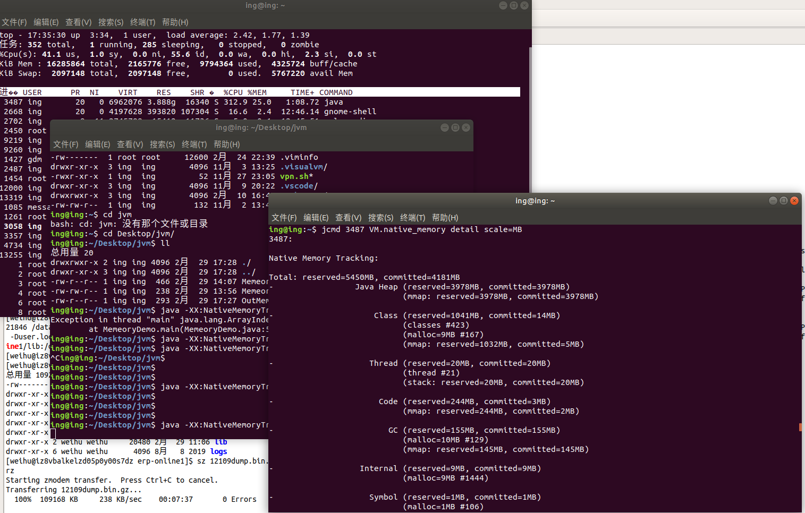
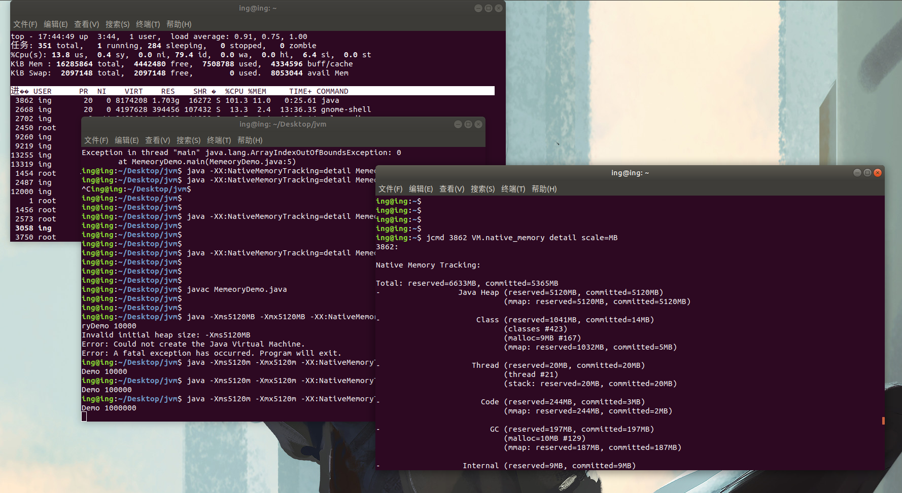

# Memory analyzer

### Tools

#### top 命令：


VIRT  --  Virtual Memory Size (KiB)
           The total amount of virtual memory used by the task.  It includes all code, data and shared libraries plus pages that have been swapped out and pages that have been mapped but not used.

1、进程“需要的”虚拟内存大小，包括进程使用的库、代码、数据等
2、假如进程申请100m的内存，但实际只使用了10m，那么它会增长100m，而不是实际的使用量


SHR  --  Shared Memory Size (KiB)
           The amount of shared memory available to a task, not all of which is typically resident.  It simply reflects memory that could be potentially shared with other processes.

1、除了自身进程的共享内存，也包括其他进程的共享内存
2、虽然进程只使用了几个共享库的函数，但它包含了整个共享库的大小
3、计算某个进程所占的物理内存大小公式：RES – SHR
4、swap out后，它将会降下来


RES  --  Resident Memory Size (KiB)

​	The non-swapped physical memory a task is using.

1、进程当前使用的内存大小，但不包括swap out
2、包含其他进程的共享
3、如果申请100m的内存，实际使用10m，它只增长10m，与VIRT相反
4、关于库占用内存的情况，它只统计加载的库文件所占内存大小


https://elixir.bootlin.com/linux/v4.0/source/fs/proc/array.c


```
int task_statm(struct mm_struct *mm, int *shared, int *text,int *data, int *resident){
*shared = get_mm_counter(mm, file_rss);

*text = (PAGE_ALIGN(mm->end_code) - (mm->start_code & PAGE_MASK)) >> PAGE_SHIFT;

*data = mm->total_vm - mm->shared_vm;

*resident = *shared + get_mm_counter(mm, anon_rss);

 return mm->total_vm;

}
```


```
[weihu@iz8vbalkelzd05p0y00s7dz erp-online1]$ jmap -heap 24832
Attaching to process ID 24832, please wait...
Debugger attached successfully.
Server compiler detected.
JVM version is 24.80-b11

using parallel threads in the new generation.
using thread-local object allocation.
Concurrent Mark-Sweep GC

Heap Configuration:
   MinHeapFreeRatio = 40
   MaxHeapFreeRatio = 70
   MaxHeapSize      = 4294967296 (4096.0MB)
   NewSize          = 2147483648 (2048.0MB)
   MaxNewSize       = 2147483648 (2048.0MB)
   OldSize          = 5439488 (5.1875MB)
   NewRatio         = 2
   SurvivorRatio    = 6
   PermSize         = 21757952 (20.75MB)
   MaxPermSize      = 402653184 (384.0MB)
   G1HeapRegionSize = 0 (0.0MB)

Heap Usage:
New Generation (Eden + 1 Survivor Space):
   capacity = 1879048192 (1792.0MB)
   used     = 1440771360 (1374.0266418457031MB)
   free     = 438276832 (417.9733581542969MB)
   76.67559385299683% used
Eden Space:
   capacity = 1610612736 (1536.0MB)
   used     = 1389603000 (1325.2286911010742MB)
   free     = 221009736 (210.77130889892578MB)
   86.27790957689285% used
From Space:
   capacity = 268435456 (256.0MB)
   used     = 51168360 (48.797950744628906MB)
   free     = 217267096 (207.2020492553711MB)
   19.061699509620667% used
To Space:
   capacity = 268435456 (256.0MB)
   used     = 0 (0.0MB)
   free     = 268435456 (256.0MB)
   0.0% used
concurrent mark-sweep generation:
   capacity = 2147483648 (2048.0MB)
   used     = 923216816 (880.4481658935547MB)
   free     = 1224266832 (1167.5518341064453MB)
   42.990633100271225% used
Perm Generation:
   capacity = 177274880 (169.0625MB)
   used     = 104766856 (99.91345977783203MB)
   free     = 72508024 (69.14904022216797MB)
   59.09853443420749% used

44245 interned Strings occupying 3897584 bytes.
```


#### jcmd java 命令工具集

jcmd <pid>  help  查看当前进程支持的jcmd 命令选项


jcmd 18138 VM.native_memory detail scale=MB     

-XX:NativeMemoryTracking=detail

[NMT]: https://docs.oracle.com/javase/8/docs/technotes/guides/troubleshoot/tooldescr007.html


```
reserved表示应用可用的内存大小，committed表示应用正在使用的内存大小
Total:  reserved=5925809KB,  committed=5614741KB

-                 Java Heap (reserved=5644288KB, committed=5351616KB)
                            (mmap: reserved=5644288KB, committed=5351616KB)
 
-                     Class (reserved=3342KB, committed=3342KB)
                            (classes #17546)
                            (malloc=3342KB, #27829)
 
-                    Thread (reserved=129557KB, committed=129557KB)
                            (thread #451)
                            (stack: reserved=127244KB, committed=127244KB)
                            (malloc=1448KB, #1814)
                            (arena=865KB, #900)
 
-                      Code (reserved=57521KB, committed=40297KB)
                            (malloc=7601KB, #9832)
                            (mmap: reserved=49920KB, committed=32696KB)
 
-                        GC (reserved=24320KB, committed=23180KB)
                            (malloc=8356KB, #116)
                            (mmap: reserved=15964KB, committed=14824KB)
 
-                  Compiler (reserved=988KB, committed=988KB)
                            (malloc=890KB, #1075)
                            (arena=98KB, #2)
 
-                  Internal (reserved=11333KB, committed=11301KB)
                            (malloc=11301KB, #12552)
                            (mmap: reserved=32KB, committed=0KB)
 
-                    Symbol (reserved=17303KB, committed=17303KB)
                            (malloc=14961KB, #160116)
                            (arena=2342KB, #1)
 
-           Memory Tracking (reserved=36914KB, committed=36914KB)
                            (malloc=36914KB, #1894)
 
-        Pooled Free Chunks (reserved=241KB, committed=241KB)
                            (malloc=241KB)
```


jcmd命令显示的内存包含堆内内存、Code区域、通过unsafe.allocateMemory和DirectByteBuffer申请的内存，但是不包含其他Native Code（C代码）申请的堆外内存


#### pmap

简要选项

   -x  extended    Show the extended format. 显示扩展格式

​    -d device     Show the deviceformat.  显示设备格式

   -q  quiet     Do not display some header/footerlines. 不显示头尾行

   -V  show version  Displays version of program. 显示版本


输出结果说明：

Address: 内存开始地址
Kbytes: 占用内存的字节数（KB）
RSS: 保留内存的字节数（KB）
Dirty: 脏页的字节数（包括共享和私有的）（KB）
Mode: 内存的权限：read、write、execute、shared、private (写时复制)
Mapping: 占用内存的文件、或[anon]（分配的内存）、或[stack]（堆栈）
Offset: 文件偏移
Device: 设备名 (major:minor)


eg :   pmap  -x 12109|sort -k 3 -nr


#### GDB

使用命令`gdb -pid pid`进入GDB之后，然后使用命令`dump memory mem.bin startAddress endAddress`dump内存，其中startAddress和endAddress可以从/proc/pid/smaps中查找。然后使用`strings mem.bin`查看dump的内容


00007f97fc52e000   60232       0       0 -----   [ anon ]
00007f97f8595000   59820       0       0 -----   [ anon ]
00007f97f4697000   58788       0       0 -----   [ anon ]
00007f97f05c4000   59632       0       0 -----   [ anon ]
00007f97ec610000   59328       0       0 -----   [ anon ]
00007f97e8698000   58784       0       0 -----   [ anon ]
00007f97e468c000   58832       0       0 -----   [ anon ]
00007f97e0633000   59188       0       0 -----   [ anon ]
00007f97dc678000   58912       0       0 -----   [ anon ]
00007f97d8606000   59368       0       0 -----   [ anon ]
00007f97d453a000   60184       0       0 -----   [ anon ]
00007f97d0675000   58924       0       0 -----   [ anon ]
00007f97cc738000   58144       0       0 -----   [ anon ]
00007f97c8669000   58972       0       0 -----   [ anon ]
00007f97c45a4000   59760       0       0 -----   [ anon ]
00007f97c067f000   58884       0       0 -----   [ anon ]


gdb -pid 12109


Strings xxxx.dump

...

(gdb)  dump memory 12109mem.bin 0x00007f97c45a4000 0x00007f97e8698000


#### gperftools


### Demo

```java
public class MemeoryDemo{

    public static void main(String[] args){

        Integer count=Integer.valueOf(args[0]);

        for(int i=0;i<count;i++){
            Integer[] test=new Integer[1*1024*1024];
        }
    }
}
```






Shallow Heap 对象自身所占用的内存大小，不包括它所引用的对象的内存大小

Retained Heap  该对象被垃圾回收器回收之后，会释放的内存大小


with outgoing references:   查看它所引用的对象

with incoming references: 查看它被哪些对象引用


堆、栈分配的内存，如果没有使用是不会占用实存的，只会记录到虚存。

如果程序占用实存比较多，说明程序申请内存多，实际使用的空间也多。

如果程序占用虚存比较多，说明程序申请来很多空间，但是没有使用。


```
JAVA进程内存 = JVM进程内存+heap内存+ 永久代内存+ 本地方法栈内存+线程栈内存 +堆外内存 +socket 缓冲区内存+元空间

linux内存和JAVA堆中的关系

RES = JAVA正在存活的内存对象大小 + 未回收的对象大小 + 其它

VIART= JAVA中申请的内存大小，即 -Xmx -Xms + 其它

其它 = 永久代内存+ 本地方法栈内存+线程栈内存 +堆外内存 +socket 缓冲区内存 +JVM进程内存
```

