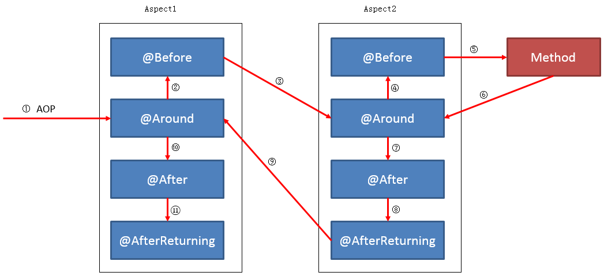

# 基于注解的Spring AOP 

###### 切面（aspect）

​		由切点+增强 组成

###### 切点 （pointcut） 

​		一组符合 表达式 的 方法 ，此类方法将被 增强

###### 增强   (advise)

​		增强代码


切点表达式：

​		within 

​		execution (* com.ing.* .*(..))

​		tagert

​		.....


配置类需要加入：  @EnableAspectJAutoProxy

```java
/**
 * 切面
 */
@Aspect
@Component("annotationTx")
public class AnnotationTx{

    final static String  PATTERN="execution(* com.ing.spring.tx..*(..))";

    /**
     * @Before,@Around,@After,@AfterReturning,@AfterThrowing  属于增强（advice）
     * 其（）中的表达式 或 方法字符 为切点（pointcut）
     *
     */

    @Before(PATTERN)
    public void beforeExe(){
        System.out.println("beforeExe");
    }

    @Before(PATTERN) //指定切点 增强
    public void beforePointcutExe(){
        System.out.println("beforePointcutExe");
    }

    @Around(PATTERN)
    public void aroundExe(){

        System.out.println("aroundExe");

    }

    @After(PATTERN)
    public void afterExe(){
        System.out.println("afterExe");
    }

    @AfterReturning(PATTERN)
    public void afterReturningExe(){
        System.out.println("afterReturningExe");
    }

    /**
     *
     * @return
     */
    @AfterReturning(pointcut = PATTERN,returning = "result")
    public void afterReturningsExe(Object result){
        System.out.println("afterReturningsExe");
    }

    /**
     * 注解中的 throwing 的值 ex 与方法参数名 需相同
     * @param ex
     */
    @AfterThrowing(pointcut = PATTERN,throwing = "ex")
    public void afterThrowingExe( Exception ex) {
        System.out.println("afterThrowingExe");
    }

    /**
     * 切点
     */
    @Pointcut(value = PATTERN) // the pointcut expression
    public void insertTx() {}// the pointcut signature

}
```


### @EnableAspectJAutoProxy 

###### proxyTargetClass

​	true
​       		目标对象实现了接口 – 使用CGLIB代理机制
​      	 	目标对象没有接口(只有实现类) – 使用CGLIB代理机制
​	false
​         	  目标对象实现了接口 – 使用JDK动态代理机制(代理所有实现了的接口)
​			   目标对象没有接口(只有实现类) – 使用CGLIB代理机制

###### exposeProxy

​	SpringAOP对于最外层的函数只拦截public方法，不拦截protected和private方法（后续讲解），另外不会对最外层的public方法内部调用的其他方法也进行拦截，即只停留于代理对象所调用的方法。

​	如果一个类中的事务A方法调用了同一个类中的事务B方法，B方法将没有事务，这个道理在AOP中也是这样的，相同类下的不同方法互相调用，内部方法将无法被应用通知（无法进行AOP），此时你需要将expose-proxy属性设置为true，暴露一个代理类（此属性的原理在下面会有详细讲解），然后在A方法中需要调用B方法的话需要这样写：

```java
public class Service{
    public void A(){
        ((Service)AopContext.currentProxy()).B();
    }

  public void B(){
	//do something...
  }
}
```


### AnnotationAwareAspectJAutoProxyCreator  extends AbstractAutoProxyCreator

AnnotationAwareAspectJAutoProxyCreator 通过 @EnableAspectJAutoProxy 注解的  @Import(AspectJAutoProxyRegistrar.class) 中的reigstry 注入


在context.refresh() 中的finishBeanFactoryInitialization ->preInstantiateSingletons方法会读取带有切面(@Aspect)注解类

org.springframework.aop.framework.autoproxy.AbstractAutoProxyCreator#postProcessBeforeInstantiation


在Bean初始化时 调用 BeanPostProcessor 的 applyBeanPostProcessorsAfterInitialization进入增强


注意bean的生命周期部分是：

生成bean->...->注入依赖

​		->BeanNameAware#setBeanName

​				->BeanPostProcessor#postProcessBeforeInitialization

​						->InitializingBean#afterPropertiesSet

​								->bean#initMethod(bean自己内部初始化方法)

​									->**BeanPostProcessor#postProcessAfterInitialization**


### 一切的AOP增强代理从此开始

org.springframework.aop.framework.autoproxy.AbstractAutoProxyCreator#postProcessAfterInitialization

1、读取切面类，从切面类中获取advisors 增强器集合org.springframework.aop.aspectj.annotation.BeanFactoryAspectJAdvisorsBuilder#buildAspectJAdvisors

2、循环读取 pointcut ，pointcut表达式匹配被代理类 如果为true，则被代理 。org.springframework.aop.aspectj.AspectJExpressionPointcut#matches(java.lang.Class<?>)

3、pointcut 表达式匹配 代理类方法 org.springframework.aop.IntroductionAwareMethodMatcher#matches

4、返回支持的增强器集合，并添加扩展增强器。org.springframework.aop.framework.autoproxy.AbstractAdvisorAutoProxyCreator#findEligibleAdvisors

5、创建代理 org.springframework.aop.framework.autoproxy.AbstractAutoProxyCreator#createProxy

6、包装增强器 org.springframework.aop.framework.autoproxy.AbstractAutoProxyCreator#buildAdvisors

7、生成代理类 org.springframework.aop.framework.CglibAopProxy#getProxy(java.lang.ClassLoader)

8、执行方法时，被代理拦截器增强处理：org.springframework.aop.framework.CglibAopProxy.DynamicAdvisedInterceptor#intercept

9、执行AOP通知  org.springframework.aop.framework.ReflectiveMethodInvocation#proceed


### @Before @Around @After  @AfterReturning  @AfterThrowing 的执行顺序

单个Aspect 正常情况


单个Aspect 异常情况


多个Aspect 的情况





